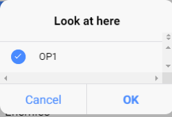
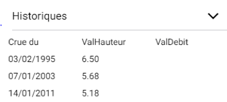

# Initialisation

[Doc ionic3]: https://ionicframework.com/docs/v3/
[Structure d'un projet ionic3]: https://ionicframework.com/docs/v3/intro/tutorial/project-structure/


## Création d'un projet ionic3

```powershell
ionic start myApp --type=ionic-angular
```

## Ajouter le platform Android

```powershell
ionic cordova platform add android
```

## Lancer l'app dans le navigateur

```she
ionic serve -l
```

## Une extension dans VS Code pour faciliter le développement


# Composants

## Menu bar

* Dans ***app.components.ts* :**

1. Importer les composants nécessaires

   ```typescript
   import { Nav } from 'ionic-angular';
   import { ViewChild } from '@angular/core';
   ```

2. Déclarer ces variable dans la class *MyApp*

   ```typescript
   @ViewChild(Nav) nav: Nav;
   //L’ensemble des pages dans le menu bar, il peut être personnalisé 
   //ex : Array<{icon: string, title: string, component: any}>;
   pages: Array<{title: string, component: any}>; 
   ```

3. Déclarer dans le constructeur toutes les pages qui seront dans le menu bar

   ```typescript
   // used for an example of ngFor and navigation
       this.pages = [
         { title: 'Home', component: HomePage }
       ];
       });
   ```

4. Ajouter une méthode « openPage(page) » pour ouvrir une page

   ```typescript
   openPage(page) {
       // Reset the content nav to have just this page
       // we wouldn't want the back button to show in this scenario
       this.nav.setRoot(page.component);
     }
   ```

   

* Dans ***app.html* :**

1. Remplacer le contenu par le code ci-dessous

   ```php+HTML
   <ion-menu [content]="content">
       <ion-header>
         <ion-toolbar>
           <ion-title>Menu</ion-title>
         </ion-toolbar>
       </ion-header>
       <ion-content>
         <ion-list>
           <button menuClose ion-item *ngFor="let p of pages" (click)="openPage(p)">
             {{p.title}}
           </button>
         </ion-list>
       </ion-content>
   </ion-menu>
   
   <!-- Disable swipe-to-go-back because it's poor UX to combine STGB with side menus -->
   <ion-nav [root]="rootPage" #content swipeBackEnabled="false"></ion-nav>
   
   ```

* Pour toutes pages qui peuvent revenir au menu dans le dossier ***pages/***:

  1. Ajouter l’icon de menu à cliquer dans toutes les pages (xxx.html) :

  ```php+HTML
  <!-- ajouter le dans <ion-navbar>, <ion-navbar> gère l’entête de l’écran -->
  <button ion-button menuToggle>
       <ion-icon name="menu"></ion-icon>
  </button>
  
  ```


## Nouvelle page

1. Générer une page vide avec la commande

   ```shell
   ionic g page NomPage
   ```

2. Importer et déclarer la nouvelle page dans ***app.module.ts***

   ```typescript
   import { FavorisPage } from '../pages/favoris/favoris' ;
   declarations: [
       … …,
       FavorisPage
     ],
   entryComponents: [
       … …,
       FavorisPage
     ],
   ```

## Navigation entre les pages

[Doc officiel]: https://ionicframework.com/docs/v3/api/navigation/NavController/

### Naviguer depuis une page

- Ajouter cette méthode dans le controller de la page (fichier .ts)

```typescript
openPage(event, item){
    //si besoin de retour à la page précédente
    this.navCtrl.push(FavorisPage, {
      item: item
    });
  
  //OU
  
	//sans retour à la page précédente
   this.navCtrl.setRoot(FavorisPage, {
    item: item
  	});
	}

```

### Naviguer depuis un Overlay Component (popover, alert, etc.)

Dans le doc officiel, on est censé d’ajouter 2 controllers :

```typescript
public viewCtrl: ViewControler
public appCtrl: App
```

et d’appeler deux méthodes :

```typescript
this.viewCtrl.dismiss();
this.appCtrl.getRootNav().push(SecondPage);
```

Par contre, pour l’instant je le trouve inutile d’ajouter ces deux controllers pour les alerts car quand on clique sur un bouton , l’alert disparaîtra automatiquement et ‘this.viewCtrl.dismiss();’ risque de produire une erreur car il essaie de faire dispaître une deuxième fois cet alert. 

Donc pour un alert on peut faire comme dans **Naviguer depuis une page** avec ‘navCtrl’.

Si les méthodes dans la section précedente ne fonctionnent pas bien, regarde dans le doc officiel les méthodes dismiss() etc.

## Popup (Alert)

[Doc officiel]: https://ionicframework.com/docs/v3/api/components/alert/AlertController/

Tout popup peut être présenté comme un Alert Component :


Prenons un exemple de **Radio Alert**:


Par exemple on veut l'ajouter dans ***HomePage***:

- Dans ***home.html***:

  1. Associé l’évènement « click » à une balise (ici on l’associe à un button) dans « home.html »

     ```php+HTML
     <button ion-button (click) = "openAlert()"> RadioAlert </button>
     ```

- Dans ***home.ts***:

  1. Importer et ajouter “AlertController” dans le constructeur de HomePage :

     ```typescript
     import { NavController, AlertController } from 'ionic-angular';
     constructor(public navCtrl: NavController, private alertController:
     AlertController) {}
     ```

  2. Implémenter la méthode **openAlert()**:

     ```typescript
     openAlert(){
         /*Première façcon*/
         let myAlert = this.alertController.create();
         myAlert.setTitle("Lightsaber color");
         myAlert.addInput({
           type: 'radio',
           label: 'Blue',
           value: "blue"
         });
         myAlert.addButton({
           text: 'Cancel',
           role: 'cancel',
           handler: () => {
             console.log('Cancel clicked');
           }});
         
         /*Dexième façon*/
         let myAlert = this.alertController.create({
           title: 'Lightsaber color',
           message: 'A short message',
           inputs: [
             {
               type: 'radio',
               label: 'Blue',
               value: "blue"
             }
           ],
           buttons:[
             {
               text: 'Cancel',
               role: 'cancel',
               handler: () => {
                 console.log('Cancel clicked');
               }
             }
           ]
     });
     //Faire apparaître l’alert
         myAlert.present();
       }
     ```


## Popup avec l’affichage du choix (radio) :

* Snippet: **ion-select**

[Doc officiel]: https://ionicframework.com/docs/v3/components/#select

Vue:

-->-->

Code:

```php+HTML
<ion-item>
    <ion-label>Look At Here</ion-label>
    <ion-select [(ngModel)]="val" multiple="false" >
      <ion-option value="OP1" >op1</ion-option>
    </ion-select>
</ion-item>
```


## Buttons

### Bouton normal

- Snippet: **ion-button**

[Différentes options et leurs vues:]: https://ionicframework.com/docs/v3/api/components/button/Button/


### Fab Button

 --> 

- Snippet: ion-fab-list

[Doc officiel]: https://ionicframework.com/docs/v3/api/components/fab/FabList/


###Toggle Button


- Snippet: ion-toggle

[Doc officiel]: https://ionicframework.com/docs/v3/api/components/fab/FabList/


### SegmentButton


- Snippet: **ion-segment**

[Doc officiel]: https://ionicframework.com/docs/v3/api/components/segment/SegmentButton/

```php+HTML
<!-- Segment buttons with icons -->
  <ion-segment [(ngModel)]="icons" color="secondary">
    <ion-segment-button value="camera">
      <ion-icon name="camera"></ion-icon>
    </ion-segment-button>
    <ion-segment-button value="bookmark">
      <ion-icon name="bookmark"></ion-icon>
    </ion-segment-button>
  </ion-segment>

  <!-- Segment buttons with text -->
  <ion-segment [(ngModel)]="relationship" color="primary">
    <ion-segment-button value="friends" (ionSelect)="selectedFriends()">
      Friends
    </ion-segment-button>
    <ion-segment-button value="enemies" (ionSelect)="selectedEnemies()">
      Enemies
    </ion-segment-button>
  </ion-segment>
```


## Check Box


- Snippet: **ion-checkbox**

[Doc officiel]: :https://ionicframework.com/docs/v3/api/components/checkbox/Checkbox/

```php+HTML
<ion-list>

    <ion-item>
      <ion-label>Pepperoni</ion-label>
      <ion-checkbox [(ngModel)]="pepperoni"></ion-checkbox>
    </ion-item>
  
    <ion-item>
      <ion-label>Sausage</ion-label>
      <ion-checkbox [(ngModel)]="sausage" disabled="true"></ion-checkbox>
    </ion-item>
  
    <ion-item>
      <ion-label>Mushrooms</ion-label>
      <ion-checkbox [(ngModel)]="mushrooms"></ion-checkbox>
    </ion-item>
  
 </ion-list>
```


## RadioList/RadioGroup :


[Doc officiel]: https://ionicframework.com/docs/v3/api/components/radio/RadioGroup/

```php+HTML
<ion-list radio-group [(ngModel)]="langage">
  
    <ion-list-header>
      LANGUAGE
    </ion-list-header>
  
    <ion-item>
      <ion-label>Python</ion-label>
      <ion-radio value="python"></ion-radio>
    </ion-item>
  
    <ion-item>
      <ion-label>Ruby</ion-label>
      <ion-radio value="ruby"></ion-radio>
    </ion-item>
  
</ion-list>
```


## Chips


> ‘Chips represent complex entities in small blocks, such as a contact.’

[Doc officiel]: https://ionicframework.com/docs/v3/api/components/chip/Chip/


## DateTime

- Snippet: ion-datetime

[Doc officiel]: https://ionicframework.com/docs/v3/api/components/datetime/DateTime/


## Grid (table in html) 

[Doc officiel]: :https://ionicframework.com/docs/v3/api/components/grid/Grid/

```php+HTML
<ion-grid *ngIf="isShow">
      <ion-row>
        <ion-col col-4>Crue du</ion-col>
        <ion-col col-4>ValHauteur</ion-col>
        <ion-col col-4>ValDebit</ion-col>
     </ion-row>
     <ion-row *ngFor="let historique of historiques">
        <ion-col col-4>{{ historique.LbUsuel | slice:8}}</ion-col>
        <ion-col col-4>{{ historique.ValHauteur }}</ion-col>
        <ion-col col-4>{{ historique.ValDebit }}</ion-col>
     </ion-row>     
</ion-grid>
```


# Modules

## Création d'une service

1. Créer un provider (service) avec la commande

   ```shell
   ionic g provider yt
   ```

2. Ajouer le nouveau provider dans **app.module.ts** dans *‘providers’*(si ce n'est pas  fait automatiquement)

3. Importer HttpClientModule dans *app.module.ts* si ce n’est pas encore fait

   ```typescript
   import { HttpClientModule } from '@angular/common/http'; 
   @NgModule({
   …
     imports: […, HttpClientModule],
   …})
   
   ```


## Gestion des évènements (Events) :

[Doc officiel]: https://ionicframework.com/docs/v3/api/util/Events/

1. Importer et Injecter *Events* dans le constructeur

2. ```typescript
   import { Events } from 'ionic-angular';
   
   constructor(public events: Events) {}
   ```

2. Publier/Ecouter à un évènement

   ```typescript
   // first page (publish an event when a user is created)
   constructor(public events: Events) {}
   createUser(user) {
     console.log('User created!')
     this.events.publish('user:created', user, Date.now());
   }
   
   // second page (listen for the user created event after function is called)
   constructor(public events: Events) {
     events.subscribe('user:created', (user, time) => {
   // user and time are the same arguments passed in `events.publish(user, time)`
       console.log('Welcome', user, 'at', time);
     });
   }
   ```


## (Dé)plier un élément

Plié : 

Déplié: 

```php+HTML
<ion-item>
    Historiques
    <ion-icon name="arrow-down" item-right  *ngIf="isShow"    (click)="isShow=!isShow"></ion-icon>
    <ion-icon name="arrow-forward" item-right *ngIf="!isShow" (click)="isShow=!isShow"></ion-icon>
  </ion-item>
  //Grâce à *ngIf="isShow", on peut décider si un élément doit être affiché
  //isShow doit être déclaré dans le controller (fichier .ts)
  <ion-grid *ngIf="isShow">
      <ion-row>
        <ion-col col-4>Crue du</ion-col>
        <ion-col col-4>ValHauteur</ion-col>
        <ion-col col-4>ValDebit</ion-col>
     </ion-row>
     <ion-row *ngFor="let historique of historiques">
        <ion-col col-4>{{ historique.LbUsuel | slice:8}}</ion-col>
        <ion-col col-4>{{ historique.ValHauteur }}</ion-col>
        <ion-col col-4>{{ historique.ValDebit }}</ion-col>
     </ion-row>     
  </ion-grid>
```

